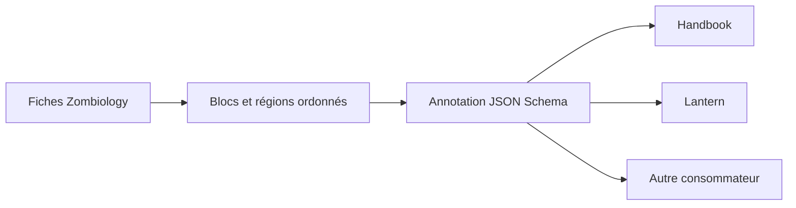
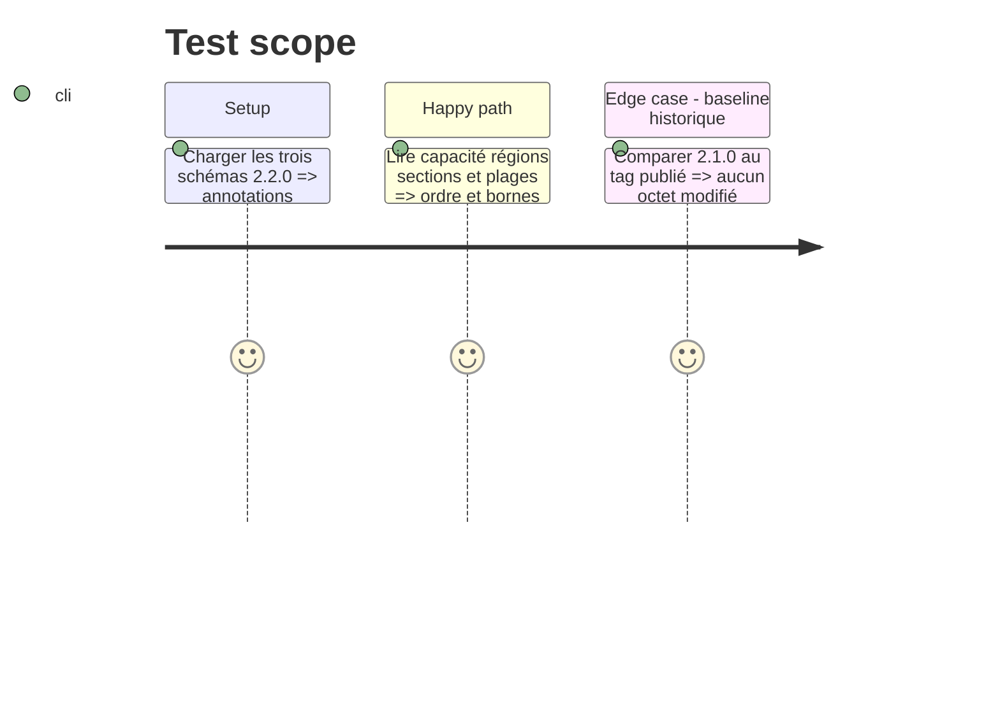

# Instruction: Contrat de présentation et nouvelle baseline

## Architecture projection

> Tree of the final files. ✅ create · ✏️ modify · ❌ delete

```txt
src/
├── ✅ presentation.ts                   # vocabulaire fermé et descripteurs PJ, PNJ, Monstre
├── ✏️ zod/adrenaline/{pj,pnj,monstre}.ts # annotation racine de chaque schéma
├── ✏️ contract-version.ts               # baseline additive 2.2.0
└── ✏️ index.ts                          # exports publics des descripteurs et types
schemas/adrenaline/
├── ✏️ {pj,pnj,monstre}.schema.json       # dernières formes annotées
└── ✅ 2.2.0/{pj,pnj,monstre}.schema.json # gel immuable de la nouvelle baseline
```

## User Journey



## Tasks to do

### `1)` Définir le vocabulaire déclaratif

> Publier seulement les primitives de présentation communes dont les consommateurs ont besoin.

1. Définir une version, une capacité `block:*`, un bloc, des régions, des sections, des chemins JSON Pointer et des dispositions finies.
2. Déclarer l'affichage uniforme des plages `minimum/current/maximum` et la dérivation des bornes scalaires depuis JSON Schema.
3. Refuser toute clé exécutable, chemin de module, classe CSS ou composant consommateur.

### `2)` Décrire les trois fiches

> Reprendre les regroupements et l'ordre visibles sur PJ, PNJ et Monstre.

1. PJ : en-tête, compétences/formations, identité-caractéristiques, équipement, santé et état de partie.
2. PNJ : en-tête narratif, caractéristiques, santé/protections, formations-compétences, équipement et état de partie.
3. Monstre : identité, détection/déplacement, comportement/combat, caractéristiques-santé, capacités/états, équipement et état de partie.

### `3)` Publier sans muter 2.1.0

> Donner aux annotations une baseline immuable propre.

1. Passer la baseline à `2.2.0` et régénérer les schémas courants et gelés.
2. Vérifier que `2.1.0` demeure inchangé.

## Test Scope



## Test acceptance criteria

| Task | Acceptance criteria |
| --- | --- |
| 1 | Le vocabulaire est fini, typé, sans configuration exécutable et décrit explicitement les plages et bornes. |
| 2 | Chaque propriété racine de PJ, PNJ et Monstre appartient exactement à une section ordonnée, sous la capacité `block:*` correspondante. |
| 3 | Les schémas courants et `2.2.0` portent les mêmes annotations hors `$id`, tandis que `2.1.0` reste intact. |
