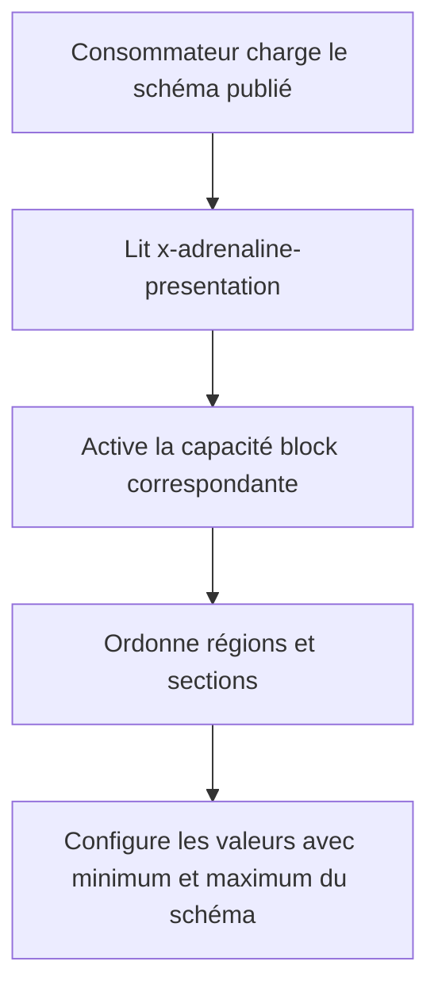
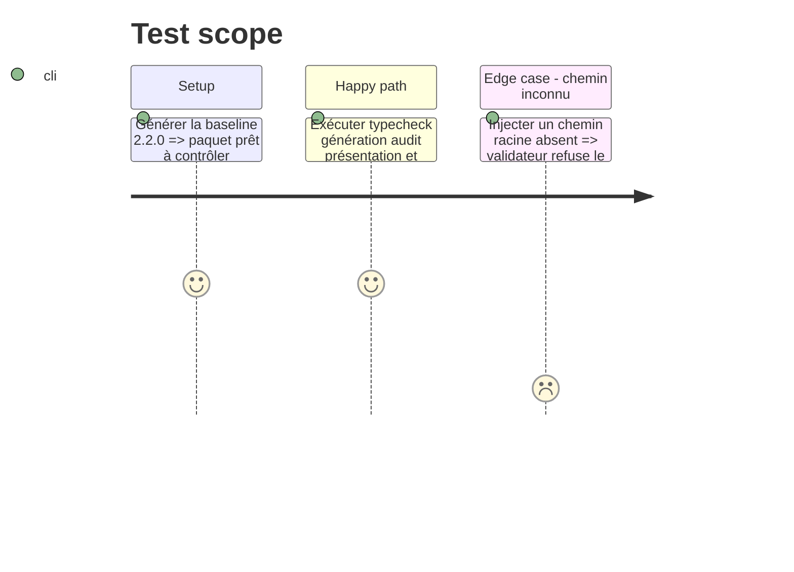

# Instruction: Validation, documentation et paquet public

## Architecture projection

> Tree of the final files. ✅ create · ✏️ modify · ❌ delete

```txt
tools/
└── ✅ validate-presentation.ts           # contrôle structure, chemins, couverture et capacités
package.json                              # ✏️ baseline exportée et porte de validation
README.md                                 # ✏️ contrat de présentation et consommation des bornes
CHANGELOG.md                              # ✏️ évolution additive documentée
```

## User Journey



## Tasks to do

### `1)` Verrouiller le descripteur

> Empêcher les annotations incomplètes ou divergentes.

1. Vérifier la version, la capacité, l'unicité des identifiants et ordres et la sûreté des chemins.
2. Vérifier que chaque propriété racine est couverte exactement une fois et que le premier segment de chaque chemin existe.
3. Vérifier que toutes les valeurs numériques du schéma conservent minimum et maximum.

### `2)` Publier et expliquer

> Rendre la nouvelle baseline consommable depuis le paquet.

1. Exporter la baseline `2.2.0` et les descripteurs publics.
2. Documenter que l'annotation appartient au schéma et que les données continuent de refuser `presentation`.
3. Ajouter la validation au contrôle complet et consigner l'évolution dans le changelog.

## Test Scope



## Test acceptance criteria

| Task | Acceptance criteria |
| --- | --- |
| 1 | Le validateur accepte les trois descripteurs réels et son auto-test refuse une capacité, un chemin ou une couverture invalides. |
| 2 | Le paquet exporte `2.2.0`, documente la consommation et passe les validations ciblées et complètes. |
