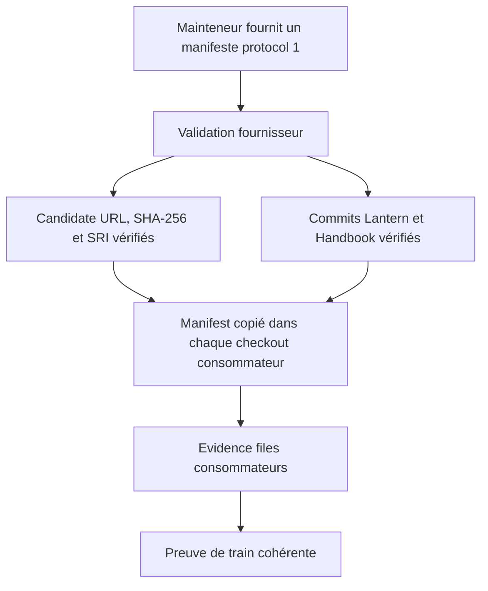
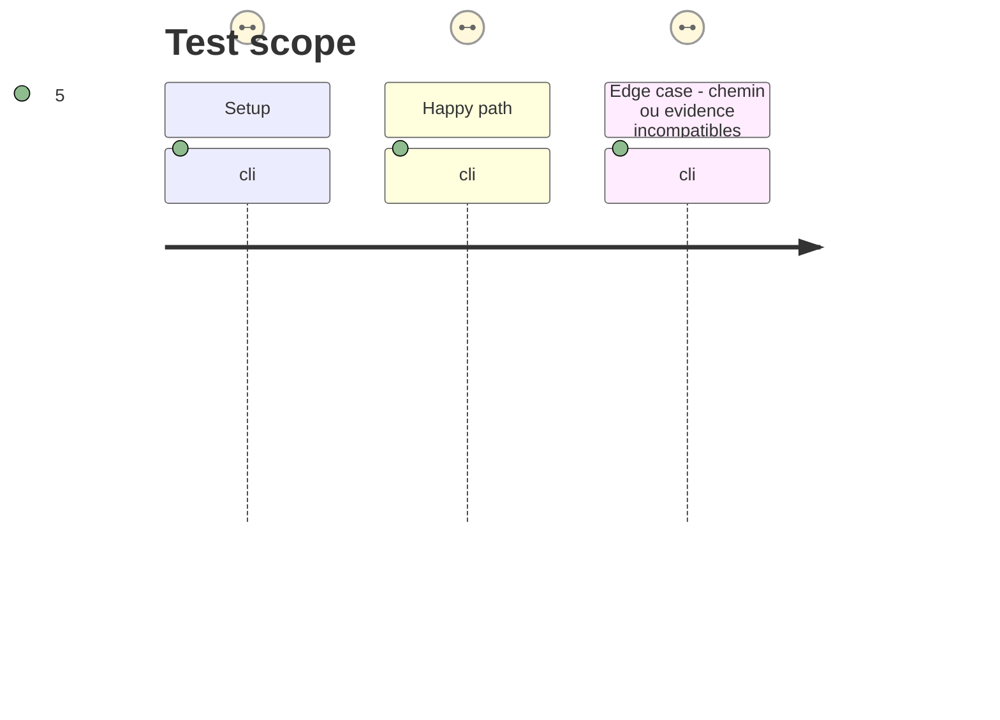

# Instruction: Aligner le fournisseur sur protocol 1

## Architecture projection

> Tree of the final files. ✅ create · ✏️ modify · ❌ delete

```txt
.
├── .github/workflows/
│   ├── release-train.yml                ✏️ copier le manifeste dans chaque checkout et collecter les evidence files protocol 1
│   └── release.yml                      ✏️ lire les champs protocol 1 et conserver la porte de train approuvé avant promotion
├── release-train/
│   └── README.md                        ✏️ documenter le contrat protocol 1 réellement envoyé aux consommateurs
└── tools/
    ├── assert-release-train.ts          ✏️ analyser strictement candidate et consumers protocol 1, puis contrôler SHA-256 et SRI
    └── verify-release-train-proofs.ts   ✏️ vérifier les evidence files structurés de Lantern et Handbook contre le manifeste
```

## User Journey



## Test Scope



## Tasks to do

### `1)` Remplacer le contrat local par le protocole commun

> Rendre le parseur fournisseur exactement compatible avec les assertions déjà livrées par Lantern et Handbook.

1. Remplacer la forme racine `manifestVersion`/`provider`/objet `consumers` par `protocol: 1`, `candidate` complet et tableau de consommateurs ordonné sans dépendre de l'ordre.
2. Valider les huit champs de candidate : fournisseur Adrenaline, URL GitHub HTTPS de la RC, SHA-256, SRI SHA-512, version, tags, et commit fournisseur complet.
3. Rejeter les clés inconnues, références mutables, URL locale ou signée, tags/version incohérents, intégrités incorrectes et tout consommateur absent, dupliqué ou non canonique.
4. Faire vérifier le téléchargement contre le SHA-256 et le SRI déclaré, puis ajouter des auto-tests positifs et négatifs aux validateurs sans toucher aux fichiers inclus dans le tarball candidat.

### `2)` Faire circuler et contrôler les evidence files canoniques

> Donner à chaque consommateur un manifeste relatif à son checkout, puis vérifier son résultat propriétaire sans l'interpréter comme une sortie ad hoc.

1. Dans `release-train.yml`, matérialiser une copie du manifeste sous un nom relatif dans chaque checkout avant `release-train:assert`.
2. Collecter `release-train.json.evidence.json` dans l'espace de travail du fournisseur au lieu de rediriger la dernière ligne standard.
3. Adapter `verify-release-train-proofs.ts` à l'evidence protocol 1 : candidate identique, rôle/dépôt/ref épinglés, résolution lockfile identique, et parcours au statut `passed`.
4. Adapter `release.yml` aux chemins `candidate.providerCommit`, `candidate.releaseUrl` et `candidate.sha256`, tout en gardant la vérification du tarball reconstruit comme contrôle d'identité avant upload.
5. Documenter le manifeste unique, le nom des evidence files et la séparation entre preuve de train et CI quotidienne.

## Test acceptance criteria

| Task | Acceptance criteria |
| ---- | -------------------------------- |
| 1 | Un manifeste protocol 1 valide la candidate Adrenaline RC, ses deux commits consommateurs complets, son SHA-256 et son SRI; toute forme héritée ou mutable est refusée. |
| 1 | Les auto-tests couvrent au minimum une candidate correcte, un champ supplémentaire, une URL non canonique, un digest divergent et une liste de consommateurs invalide. |
| 2 | Le workflow livre au consommateur un chemin relatif dans son propre checkout et produit deux evidence files protocol 1. |
| 2 | Une evidence dont candidate, consumer, lock ou journey diffère du manifeste empêche le train d'être approuvé. |
| 2 | Le workflow stable utilise uniquement les champs protocol 1 et publie toujours le fichier RC téléchargé, jamais le tarball créé pour le contrôle d'identité. |
