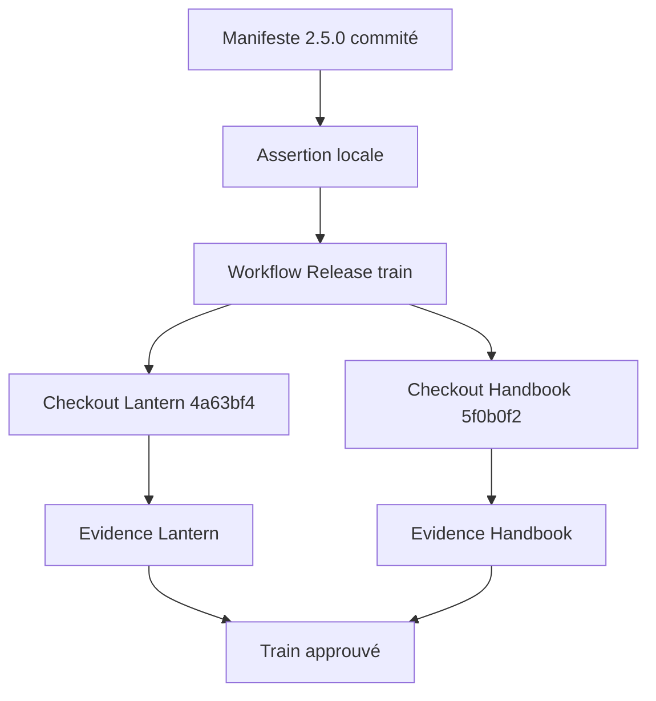
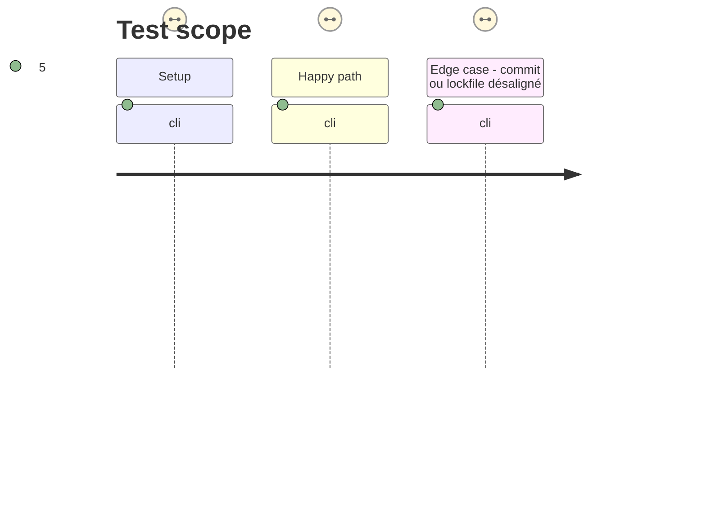

# Instruction: Figer et valider le train 2.5.0

## Architecture projection

> Tree of the final files. ✅ create · ✏️ modify · ❌ delete

```txt
.
└── release-train/
    └── schema-adrenaline-v2.5.0.json    ✅ épingler la candidate v2.5.0-rc.2 et les deux commits consommateurs prouvés
```

## User Journey



## Test Scope



## Tasks to do

### `1)` Écrire le manifeste immutable de la release

> Enregistrer une entrée auditable qui correspond à la candidate déjà vérifiée et aux consommateurs qui l'ont adoptée.

1. Créer `release-train/schema-adrenaline-v2.5.0.json` au format protocol 1.
2. Fixer `candidate.provider` à `schema-adrenaline`, `version` à `2.5.0`, `stagingTag` à `v2.5.0-rc.2`, `finalTag` à `v2.5.0` et `providerCommit` à `31c4576bc45e1fc16e4bf6592d3f3d62e7cf8b58`.
3. Fixer l'URL et le SHA-256 de l'issue, ainsi que le SRI commun `sha512-cb/ZUmHy5LYaMQPmit7tRQIybBQWW8fFN4fgeaHZYoSZHKFuQJgIFVc3p/BhgRVhT00dT7r9DZCk7gmPMTpkjQ==`.
4. Déclarer une entrée `lantern` avec le dépôt canonique et la ref `4a63bf40102120b9bda5b60b3a6396b4e243049e`, puis une entrée `handbook` avec la ref `5f0b0f262d789831ceb823a55df3284516ffe7b2`.
5. Avant de commiter, vérifier sur `origin` que le tag `v2.5.0-rc.2` se résout bien sur `31c4576bc45e1fc16e4bf6592d3f3d62e7cf8b58`, indépendamment du champ d'affichage de la release GitHub.

### `2)` Obtenir la preuve de train réutilisable par la stable

> Ne rendre la candidate promouvable qu'après une exécution commune dont le manifeste exact est visible dans le commit.

1. Exécuter les auto-tests, la validation du manifeste et la porte fournisseur sur le commit qui contient le manifeste.
2. Déclencher manuellement `Release train` avec le chemin commité et attendre son succès.
3. Vérifier les deux artefacts d'evidence et la correspondance de leur candidate, SRI et SHA-256 avec le manifeste.
4. Consigner l'URL du run vert dans la résolution de l'issue sans modifier le manifeste après cette approbation.

## Test acceptance criteria

| Task | Acceptance criteria |
| ---- | -------------------------------- |
| 1 | Le manifeste versionné désigne exactement l'asset `v2.5.0-rc.2`, son SHA-256 `62033e75384f17ee21e4e5e76d231b84c25b3fdcb0d5de74ecdbc89c94be95cc`, son SRI et les deux SHAs complets attendus. |
| 1 | La résolution distante du tag RC et le `providerCommit` du manifeste sont le même SHA complet. |
| 1 | Toute variation de version, URL, SHA-256, SRI, rôle, dépôt ou commit échoue avant l'appel d'un consommateur. |
| 2 | Le run Release train réussit pour le digest exact du manifeste commité et archive une evidence Lantern ainsi qu'une evidence Handbook au statut `passed`. |
| 2 | Le run n'acquiert aucune autorité depuis une branche, un tag consommateur ou une commande contenue dans le manifeste. |
