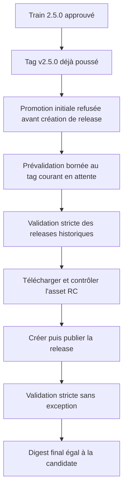
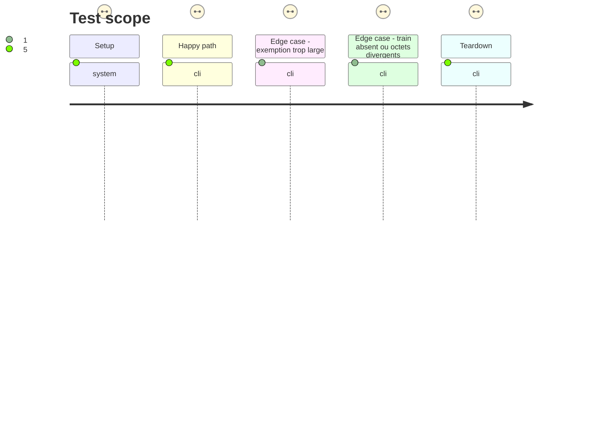

# Instruction: Promouvoir l'archive candidate identique

## Architecture projection

> Tree of the final files. ✅ create · ✏️ modify · ❌ delete

```txt
.
├── .github/workflows/
│   └── release.yml              ✏️ déclarer uniquement le tag courant comme release en attente pendant la prévalidation
└── tools/
    └── validate-versioning.ts   ✏️ distinguer une promotion en cours des releases historiques obligatoirement complètes
```

## User Journey



## Test Scope



## Tasks to do

### `1)` Casser la dépendance circulaire sans affaiblir la validation

> Autoriser la prévalidation d'un seul tag en cours de promotion, tout en refusant tout autre tag stable incomplet.

1. Étendre `validate-versioning.ts` avec un contexte explicite `SCHEMA_ADRENALINE_PENDING_RELEASE` qui ne peut désigner qu'un tag stable égal à `v${package.version}`.
2. Exiger que ce tag existe, que son commit soit ancêtre du checkout exécuté, et que sa release soit absente ou encore brouillon ; toute release publique incomplète reste une erreur.
3. Exclure uniquement ce tag de la vérification de complétude pendant la prévalidation ; tous les autres tags restent soumis aux contrôles de release non brouillon, non prerelease, immuable et dotée des deux assets.
4. Étendre le self-test pour prouver le cas en attente absent ou brouillon, le refus d'un tag différent et le maintien de l'échec pour une release historique manquante ou publique incomplète.

### `2)` Reprendre la promotion depuis le tag existant

> Livrer le correctif d'outillage et relancer le workflow sans déplacer le tag ni modifier les octets candidats.

1. Dans `release.yml`, fournir `SCHEMA_ADRENALINE_PENDING_RELEASE=$RELEASE_TAG` seulement à l'étape `Check provider release contract`; ne pas propager l'exception aux autres workflows ou validations.
2. Vérifier sous ce contexte la porte fournisseur complète et prouver que `npm pack` produit toujours le SHA-256 `62033e75384f17ee21e4e5e76d231b84c25b3fdcb0d5de74ecdbc89c94be95cc`.
3. Intégrer le correctif sur `main` sans déplacer, supprimer ni recréer `v2.5.0`, sans modifier le manifeste ou une dépendance consommateur.
4. Déclencher `Release contract` par `workflow_dispatch` avec `tag: v2.5.0`, puis vérifier que la porte de train reconnaît toujours le run 35988789960 et que la création de release est atteinte.

### `3)` Vérifier et clore la livraison

> Confirmer depuis GitHub que la stable est l'archive attestée, puis rendre l'issue réellement clôturable.

1. Contrôler que le workflow a téléchargé l'asset de `v2.5.0-rc.2`, vérifié son SHA-256, et attaché seulement le tarball et son checksum à la release stable.
2. Vérifier l'API de release : `v2.5.0` n'est ni brouillon ni prerelease, est immuable, possède exactement deux assets, et le digest de son `.tgz` vaut `sha256:62033e75384f17ee21e4e5e76d231b84c25b3fdcb0d5de74ecdbc89c94be95cc`.
3. Relancer `validate:version` sans contexte de promotion et confirmer que `v2.5.0` passe désormais la validation stricte commune.
4. Ajouter à #32 les liens du run de train, du run de promotion réparé et de la release stable, puis fermer l'issue seulement après ces contrôles.

## Test acceptance criteria

| Task | Acceptance criteria |
| ---- | -------------------------------- |
| 1 | Sans contexte de promotion, tout tag stable sans release complète continue d'échouer ; avec ce contexte, seul le tag courant du package, existant et ancêtre du checkout, peut être absent ou brouillon. |
| 1 | Un autre tag déclaré en attente, une release publique incomplète ou un tag non ancêtre est refusé par les self-tests et la validation réelle. |
| 2 | Le tag distant `v2.5.0` pointe toujours sur `8276ddaa77d8c505f6a3d55b6d3167e8498d144d`, le manifeste et les pins consommateurs restent inchangés, et le workflow stable atteint la création de release après toutes les portes. |
| 2 | Le workflow échoue avant publication lorsque le train, le manifeste, le tarball reconstruit ou l'archive candidate ne concorde pas. |
| 3 | La release `v2.5.0` est immuable, non-prerelease, contient exactement le tarball et son checksum, et le digest de son tarball égale le SHA-256 de la candidate. |
| 3 | Après publication, `validate:version` réussit sans exception et l'issue #32 contient les liens de provenance avant sa fermeture. |
