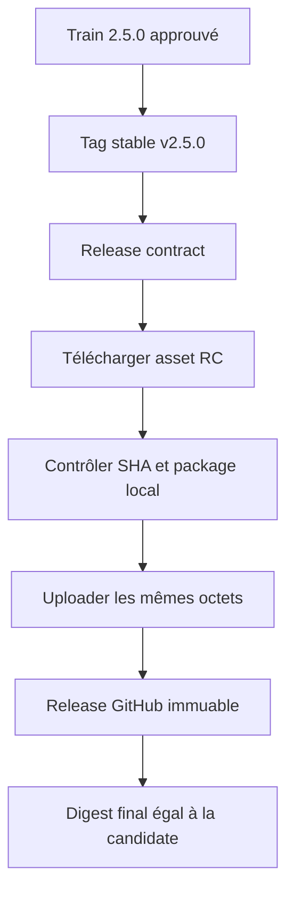
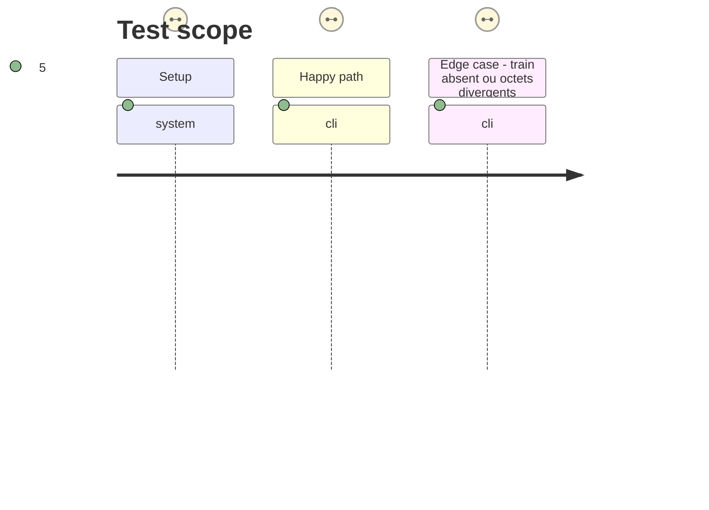

# Instruction: Promouvoir l'archive candidate identique

## Architecture projection

> Tree of the final files. ✅ create · ✏️ modify · ❌ delete

```txt
.
└── (aucun fichier suivi supplémentaire : cette phase crée le tag v2.5.0 et sa release GitHub immuable)
```

## User Journey



## Test Scope



## Tasks to do

### `1)` Déclencher uniquement la promotion autorisée

> Faire porter le tag stable par le commit contenant le manifeste approuvé, sans changer la candidate attestée.

1. Confirmer que le commit de train réussi est ancêtre du commit à taguer et que le manifeste n'a pas changé depuis son exécution.
2. Créer et pousser le tag annoté `v2.5.0` sur ce commit, puis surveiller le workflow `Release contract` déclenché par le tag.
3. Ne pas redéclencher la génération de candidate et ne pas modifier de dépendance consommateur durant cette étape.

### `2)` Vérifier et clore la livraison

> Confirmer depuis GitHub que la stable est l'archive attestée, puis rendre l'issue réellement clôturable.

1. Contrôler que le workflow a téléchargé l'asset de `v2.5.0-rc.2`, vérifié son SHA-256, et attaché seulement le tarball et son checksum à la release stable.
2. Vérifier l'API de release : `v2.5.0` n'est ni brouillon ni prerelease, est immuable, possède exactement deux assets, et le digest de son `.tgz` vaut `sha256:62033e75384f17ee21e4e5e76d231b84c25b3fdcb0d5de74ecdbc89c94be95cc`.
3. Ajouter à #32 le lien du run de train et de la release stable, puis fermer l'issue seulement après ces contrôles.

## Test acceptance criteria

| Task | Acceptance criteria |
| ---- | -------------------------------- |
| 1 | Le tag `v2.5.0` ne peut lancer une promotion que si un run Release train réussi atteste le même manifeste et le commit fournisseur requis. |
| 1 | Le workflow stable échoue sans modifier une release publique lorsque le train, le manifeste ou l'archive candidate ne concordent pas. |
| 2 | La release `v2.5.0` est immuable, non-prerelease, contient exactement le tarball et son checksum, et le digest de son tarball égale le SHA-256 de la candidate. |
| 2 | L'issue #32 contient les liens de provenance et n'est fermée qu'après la preuve GitHub de la release stable. |
