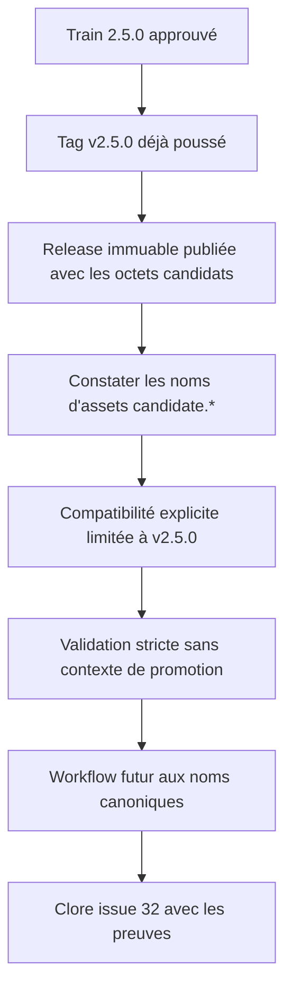
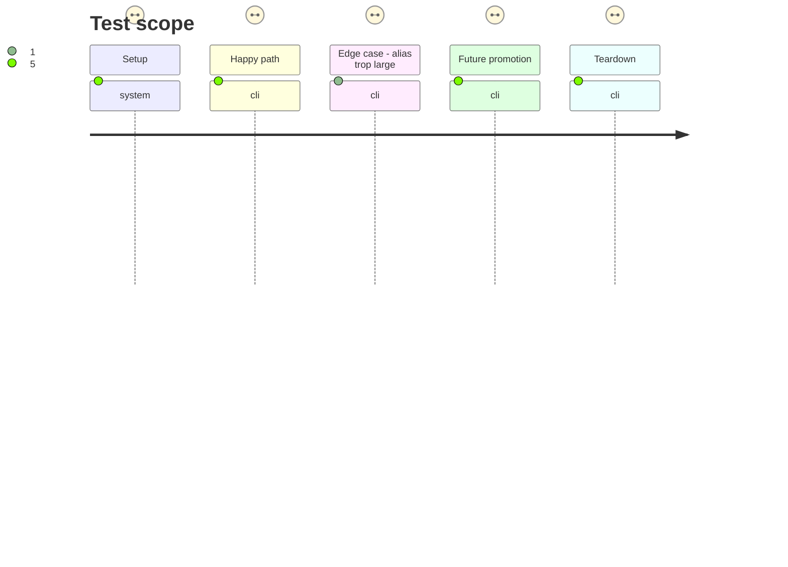

# Instruction: Promouvoir l'archive candidate identique

## Architecture projection

> Tree of the final files. ✅ create · ✏️ modify · ❌ delete

```txt
.
├── .github/workflows/
│   └── release.yml              ✏️ publier les prochaines promotions sous les noms d'assets canoniques
└── tools/
    └── validate-versioning.ts   ✏️ borner la compatibilité des noms d'assets à la release immuable v2.5.0
```

## User Journey



## Test Scope



## Tasks to do

### `1)` Préserver la release publiée et borner sa compatibilité

> Reconnaître honnêtement l'écart de nommage irréversible de `v2.5.0`, sans l'étendre au reste de l'historique.

1. Conserver la validation de promotion déjà livrée : `SCHEMA_ADRENALINE_PENDING_RELEASE` ne peut désigner que le tag stable courant, existant, ancêtre du checkout et dont la release est absente ou brouillon.
2. Déclarer dans `validate-versioning.ts` une compatibilité explicite à une entrée pour `v2.5.0`, associant exactement `candidate.tgz` et `candidate.tgz.sha256`; ne pas accepter ces noms pour une autre version.
3. Continuer d'exiger pour chaque release stable une release publique, non-prerelease, immuable et une paire complète d'assets; utiliser les noms `schema-adrenaline-<version>.tgz` et `.sha256` hors de l'exception documentée.
4. Étendre le self-test pour couvrir la paire canonique, l'alias accepté pour `v2.5.0`, le même alias refusé pour un autre tag, un asset manquant et une release publique incomplète.

### `2)` Empêcher la réapparition de l'écart de nommage

> Aligner les prochaines promotions sur le contrat canonique déjà contrôlé par le validateur.

1. Dans `release.yml`, dériver le nom `schema-adrenaline-${RELEASE_TAG#v}.tgz`, télécharger l'archive candidate sous ce nom, puis produire le checksum homonyme `.sha256`.
2. Faire circuler ces deux chemins explicites jusqu'à l'upload de release; conserver la comparaison avec `npm pack --ignore-scripts` et le SHA-256 du manifeste avant toute publication.
3. Conserver `SCHEMA_ADRENALINE_PENDING_RELEASE=$RELEASE_TAG` uniquement sur la prévalidation fournisseur; une nouvelle exécution visant une release publique doit rester refusée.
4. Vérifier statiquement le workflow et couvrir la construction des noms canoniques dans les assertions disponibles, sans relancer `v2.5.0` ni tenter de modifier ses assets immuables.

### `3)` Vérifier et clore la livraison

> Confirmer que l'exception est minimale, que le contrat ordinaire repasse, puis rendre l'issue réellement clôturable.

1. Vérifier de nouveau par l'API que `v2.5.0` n'est ni brouillon ni prerelease, est immuable, possède exactement `candidate.tgz` et `candidate.tgz.sha256`, et que le digest du tarball vaut `sha256:62033e75384f17ee21e4e5e76d231b84c25b3fdcb0d5de74ecdbc89c94be95cc`.
2. Exécuter le self-test du validateur, `npm run validate:version`, puis `npm run check` sans `SCHEMA_ADRENALINE_PENDING_RELEASE`; confirmer que l'alias borné ne masque aucune autre release invalide.
3. Intégrer les correctifs sur `main` sans déplacer ou supprimer `v2.5.0`, sans recréer sa release, et sans modifier le manifeste ou les pins consommateurs.
4. Ajouter à #32 les liens du train 35988789960, de la promotion 35996024394 et de la release stable, expliquer la compatibilité de nommage immuable, puis fermer l'issue après le passage des contrôles.

## Test acceptance criteria

| Task | Acceptance criteria |
| ---- | -------------------------------- |
| 1 | Sans contexte de promotion, toute release stable reste soumise aux contrôles stricts; seule `v2.5.0` accepte la paire complète `candidate.tgz` / `candidate.tgz.sha256`. |
| 1 | Le self-test refuse ces noms pour tout autre tag, ainsi qu'un alias partiel, une release publique incomplète, un autre tag en attente ou un tag non ancêtre. |
| 2 | Pour toute promotion future, le workflow construit et uploade `schema-adrenaline-<version>.tgz` et `schema-adrenaline-<version>.tgz.sha256`, après égalité du tarball reconstruit et de la candidate. |
| 2 | Une relance visant la release publique `v2.5.0` est refusée avant upload; le tag, la release immuable, le manifeste et les pins consommateurs restent inchangés. |
| 3 | La release `v2.5.0` conserve exactement ses deux assets actuels et le digest du tarball égale le SHA-256 de la candidate. |
| 3 | `npm run check` réussit sans contexte de promotion sur `main`, puis l'issue #32 contient les liens et l'explication de provenance avant sa fermeture. |
