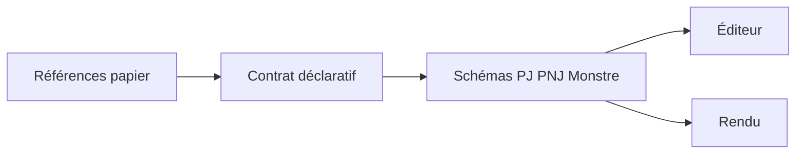
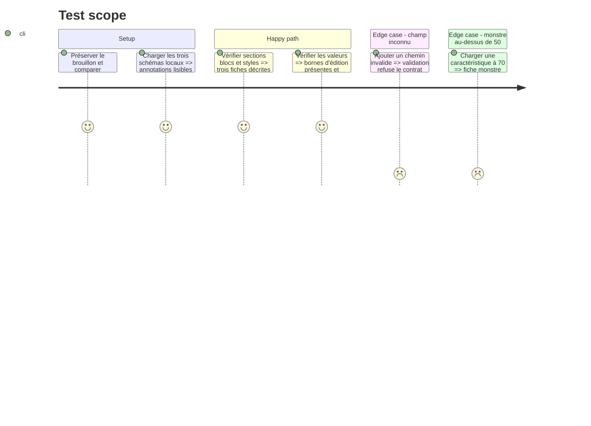

# Instruction: Branche sûre et contrat visuel

## Architecture projection

> Tree of the final files. ✅ create · ✏️ modify · ❌ delete

```txt
branche feat/zombiology-presentation-contract ✏️ préserver le brouillon et intégrer origin/main sans perdre les modifications locales
src/presentation.ts                       ✏️ sections, blocs, tokens, typographie et règles de visibilité
src/zod/adrenaline/{pj,pnj,monstre}.ts    ✏️ annotations et bornes propres aux champs
src/zod/common/etat-de-partie.ts          ✏️ fatigue optionnelle en rounds et heures, chacune bornée de 0 à 5
handbook/adrenaline/pack.json              ✏️ référence versionnée aux tokens et actifs nécessaires
handbook/adrenaline/assets/fonts/*         ✅ police manuscrite sous licence vérifiée si absente du paquet
tools/validate-presentation.ts            ✏️ chemins, couverture, valeurs et tokens
schemas/adrenaline/{pj,pnj,monstre}.schema.json ✏️ formes locales générées
```

## User Journey



## Test Scope



## Wireframe

```txt
┌───────────────────────────────────────────┐
│ (1) En-tête : nom │ paramètres │ PX       │
├───────────────────────────────────────────┤
│ (2) Formations : trois colonnes            │
├─────────────────────┬─────────────────────┤
│ (3) Identité        │ (4) Caractéristiques│
├─────────────────────┴─────────────────────┤
│ (5) Équipement : trois colonnes            │
├───────────────────────────────────────────┤
│ (6) Santé : stress │ seuils │ états        │
└───────────────────────────────────────────┘
```

1. En-tête : nom, paramètres du jeu et PX séparés.
2. Formations : trois colonnes avec type et spécialité au premier rang.
3. Identité : champs répartis en deux colonnes.
4. Caractéristiques : deux groupes de quatre, création et valeur actuelle.
5. Équipement : possessions, armes et protections.
6. Santé : stress, seuils et états encaissés.

```txt
┌─────────────────────────────────────┐
│ (1) En-tête PNJ                     │
├─────────────────────────────────────┤
│ (2) Présentation narrative          │
├─────────────────────────────────────┤
│ (3) Caractéristiques                │
├─────────────────────────────────────┤
│ (4) Santé, protections et état      │
├─────────────────────────────────────┤
│ (5) Formations et compétences       │
├─────────────────────────────────────┤
│ (6) Équipement                      │
└─────────────────────────────────────┘
```

1. En-tête : identification et danger.
2. Présentation : description et informations narratives.
3. Caractéristiques : valeurs compactes.
4. Santé : seuils, protections, malus et compteurs.
5. Formations et compétences : lignes avec pourcentages alignés.
6. Équipement : possessions et armes.

```txt
┌─────────────────────────────────────┐
│ (1) En-tête monstre                 │
├─────────────────────────────────────┤
│ (2) État principal                  │
│  détection, caractéristiques, santé │
├─────────────────────────────────────┤
│ (3) Comportement et capacités       │
├─────────────────────────────────────┤
│ (4) État alternatif                 │
├─────────────────────────────────────┤
│ (5) Équipement                      │
└─────────────────────────────────────┘
```

1. En-tête : type, nom, corps, instinct et danger.
2. État principal : détection, déplacement, caractéristiques et seuils.
3. Comportement : actions, attaques, compétences et contagion.
4. État alternatif : déclencheur et valeurs remplacées.
5. Équipement : possessions éventuelles.

## Tasks to do

### `1)` Décrire les trois fiches

> La hiérarchie et les styles viennent des références, pas du HTML autonome.

1. Préserver l'état sale existant, rapprocher la branche de `origin/main` et vérifier les baselines déjà publiées avant tout nouveau gel.
2. Compléter les sections et blocs des trois cibles avec ordre, alignement, typographie, couleurs et éléments fixes.
3. Représenter les spécificités PJ : nom manuscrit bleu, sections titrées au centre, valeurs bleues manuscrites alignées à droite, paramètres du jeu blancs, case PX et traits extérieurs.
4. Placer les trois colonnes de formations (type et spécialité sur la première ligne, pourcentages à droite), l'identité en deux colonnes et les huit caractéristiques en deux groupes de quatre avec noms complets et valeur de création puis actuelle.
5. Prévoir équipement favori, armes renseignables avec `d10` en fin de ligne, PP/PM et zones d'écriture à droite ; conserver les libellés fixes `±1d100` et `±2d100` sous les dés de stress.
6. Reprendre couleurs et cadres des malus/états, ainsi que cinq cercles rounds et cinq cercles heures pour la fatigue ; stocker facultativement les deux compteurs de fatigue bornés de 0 à 5.
7. Borner les caractéristiques PJ à 50 % dans l'éditeur sans abaisser les bornes des PNJ et monstres ; vérifier les corpus existants.
8. Déclarer les bornes d'édition sans exposer min/max dans le rendu, y compris pour les données TOML anciennes à valeur scalaire.
9. Publier la police manuscrite et les autres actifs nécessaires dans le paquet, après vérification de leur licence et de leurs chemins.

### `2)` Valider le contrat

> Un chemin ou un style manquant doit échouer avant publication.

1. Étendre les assertions à la structure, aux chemins, à la couverture, aux tokens et aux bornes.
2. Tester les trois fiches ainsi que les cas invalides.

## Test acceptance criteria

| Task | Acceptance criteria |
| --- | --- |
| 1 | Aucun brouillon local n'est perdu ; les trois annotations décrivent les sections, blocs et actifs des références. Le PJ couvre les demandes détaillées du 24 septembre, sa saisie est bornée à 50 %, et le monstre conserve ses caractéristiques supérieures à 50 %. Les compteurs absents restent vides et seuls les états actuels sont rendus. |
| 2 | La validation accepte les trois annotations et refuse les chemins, styles ou bornes invalides. |
