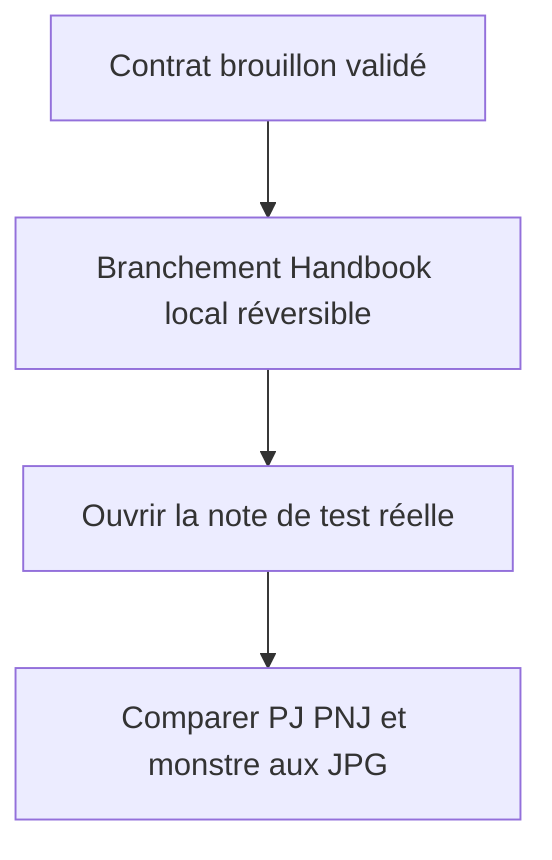
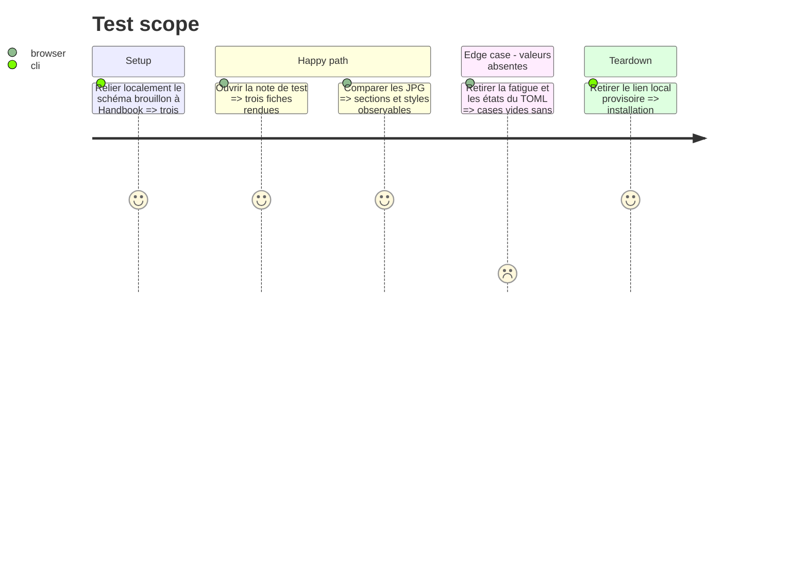

# Instruction: Prévisualisation locale dans Handbook

## Architecture projection

> Tree of the final files. ✅ create · ✏️ modify · ❌ delete

```txt
../handbook/src/features/adrenaline{Pj,Pnj,Monstre}/{parser,schema,renderer,shape}.ts ✏️ décodage et rendu local des métadonnées du brouillon
../handbook/src/features/adrenaline/{document,view}.ts             ✏️ primitives communes des trois fiches
../handbook/src/styles/adrenaline/_*.scss                       ✏️ styles pilotés par les tokens du brouillon
../handbook/tools/assertAdrenalineZombiologyStyle.harness.mts  ✏️ vérification des trois fiches
```

## User Journey



## Test Scope



## Wireframe

```txt
┌──────────────────────────────────────┐
│ (1) Note de test                      │
├──────────────────────────────────────┤
│ (2) Fiche PJ rendue                   │
├──────────────────────────────────────┤
│ (3) Fiche PNJ rendue                  │
├──────────────────────────────────────┤
│ (4) Fiche monstre rendue              │
└──────────────────────────────────────┘
```

1. Note : le fichier Markdown existant reste la cible de contrôle.
2. PJ : mise en page complète et champs de santé.
3. PNJ : carte compacte et sections narratives.
4. Monstre : état principal et état alternatif.

## Tasks to do

### `1)` Brancher le brouillon sans le livrer

> L'utilisateur doit voir le résultat dans sa note avant toute version officielle.

1. Utiliser une dépendance locale ou un mécanisme équivalent réversible, sans changer le paquet publié ni la note de test.
2. Adapter décodage et rendu des trois fiches aux sections, blocs et styles du schéma ; les adaptateurs restent propres à Handbook.
3. Préserver les valeurs des TOML existants et afficher des cases vides lorsque les compteurs sont absents.

### `2)` Vérifier visuellement

> La comparaison porte sur les JPG d'origine et les corrections demandées, pas sur le HTML autonome.

1. Ouvrir `Test Handbook — Adrenaline.md` dans l'environnement Handbook et contrôler les trois fiches, y compris à largeur réduite.
2. Documenter les écarts observés et itérer localement jusqu'à une prévisualisation présentable.
3. Débrancher tout lien temporaire après vérification sans perdre les modifications de code prêtes pour la phase 4.

## Test acceptance criteria

| Task | Acceptance criteria |
| --- | --- |
| 1 | Les trois blocs se rendent dans la note réelle à partir du contrat local, sans publication ni altération du Markdown ; aucun min/max n'apparaît sur la fiche. |
| 2 | Les références JPG et la prévisualisation locale sont comparables, les cases absentes restent vides, et le branchement provisoire est réversible. |

## Point de reprise local (25 septembre 2026)

- Handbook : branche `feat/zombiology-presentation-preview`, dépendance `schema-adrenaline` liée localement ; modifications de rendu non publiées et non validées visuellement.
- Coffre Zombiology : compilation Handbook et pack local installés provisoirement ; note `Test Handbook — Adrenaline.md` inchangée.
- Sauvegarde préalable du plugin et de la source : `tmp/zombiology-preview-backup-2026-09-25/{plugin,source}` dans ce dépôt.
- Vérifications vertes : `pnpm build`, `pnpm assert:adrenaline-documents`, `pnpm assert:adrenaline-zombiology-style --vault C:\Users\fxgui\Documents\Perso\RPG\zombiology`, `pnpm assert:contextual-pack-blocks`, `pnpm assert:contextual-toml-export` et ESLint ciblé.
- Restant : capture/contrôle visuel dans Obsidian, corrections de présentation, puis retrait du lien et restauration de l'installation provisoire selon la décision de l'utilisateur. Ne pas publier de nouvelle version avant son accord.

### Incident de prévisualisation

L'utilisateur a signalé que le plugin provisoire échouait au chargement. Les fichiers `main.js`, `styles.css`, `manifest.json` et les manifestes du pack installés ont été restaurés depuis la sauvegarde ; `data.json` et la note n'ont pas été touchés. Confirmation de redémarrage demandée. Hypothèse en cours de vérification : l'import depuis la racine du paquet embarquait aussi ses modules non visuels (bundle ~1,3 Mo). Un sous-chemin `schema-adrenaline/presentation` a été ajouté localement et ramène le bundle Handbook à ~1 Mo, sans nouveau déploiement dans le coffre. Ne pas réinstaller avant confirmation et diagnostic du message exact.

Le redémarrage de la version restaurée a été confirmé. Une seconde prévisualisation ciblée a ensuite installé uniquement `main.js` et `styles.css` construits avec le sous-chemin de présentation ; le manifeste et le pack restaurés sont laissés intacts pour isoler le chargement. Confirmation de l'utilisateur en attente.

Le second chargement a également échoué. Les fichiers du plugin ont été restaurés une nouvelle fois (tailles et dates identiques à la sauvegarde). L'utilisateur indique que le problème est désormais identifié et fera l'objet d'une issue à planifier. Le diagnostic est suspendu ; le travail doit être repris sur un autre ordinateur. Le lien `pnpm` local n'est pas destiné aux commits Handbook : son `package.json` et son verrou ont été remis au contenu publié avant sauvegarde. Le rendu Handbook reste un brouillon sur branche, à ne pas fusionner avant publication du contrat et résolution de l'issue.
