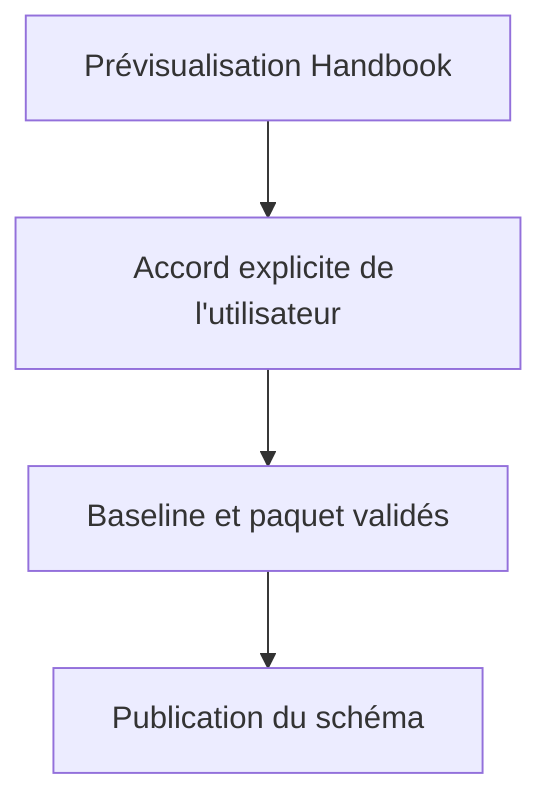
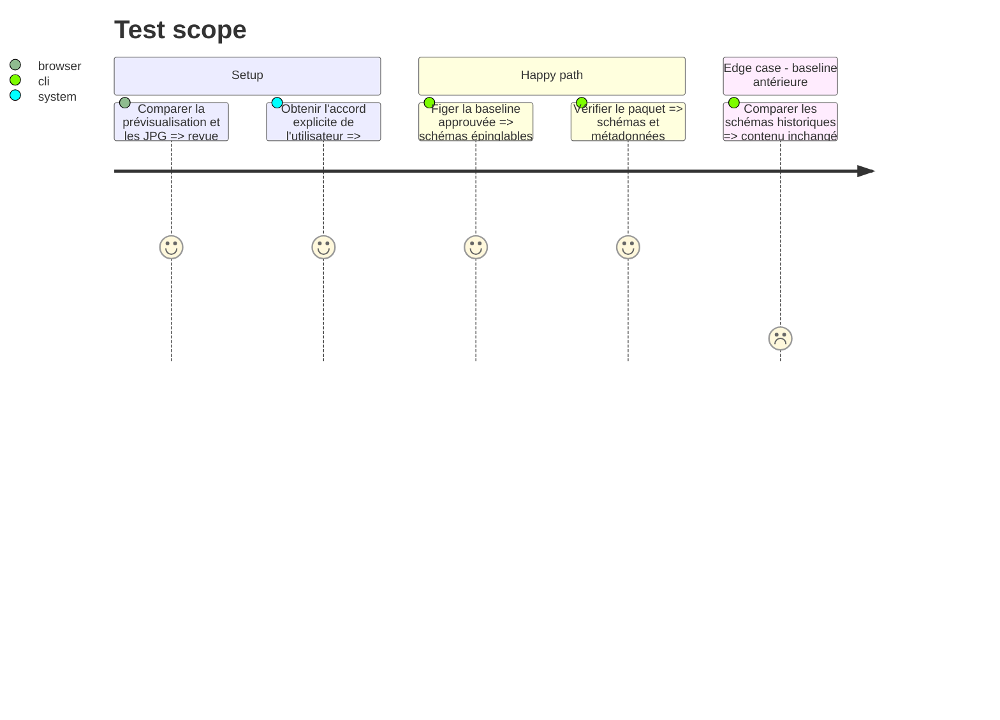

# Instruction: Revue et publication du contrat

## Architecture projection

> Tree of the final files. ✅ create · ✏️ modify · ❌ delete

```txt
schemas/adrenaline/<baseline-approuvee>/ ✅ gel immuable après revue
src/contract-version.ts                  ✏️ baseline approuvée
package.json                             ✏️ export épinglé de cette baseline
README.md                                ✏️ consommation de la présentation et des bornes
CHANGELOG.md                             ✏️ évolution du paquet
```

## User Journey



## Test Scope



## Tasks to do

### `1)` Attendre la revue

> Ne pas publier une version que l'utilisateur n'a pas vue dans Handbook.

1. Présenter la note rendue et les écarts résiduels au regard des JPG.
2. Incorporer les corrections demandées dans le contrat et la prévisualisation avant de demander l'accord de publication.

### `2)` Figer puis publier

> Les consommateurs livrés doivent utiliser une baseline immuable.

1. Choisir une baseline libre après intégration de `origin/main`, régénérer et valider le paquet complet.
2. Vérifier que les baselines déjà publiées restent octet pour octet inchangées.
3. Publier uniquement après accord explicite et noter la version effectivement publiée.

## Test acceptance criteria

| Task | Acceptance criteria |
| --- | --- |
| 1 | L'utilisateur a pu vérifier les trois fiches dans la note réelle avant toute publication. |
| 2 | Après accord, le paquet publié contient le contrat approuvé et les anciennes baselines restent inchangées. |
