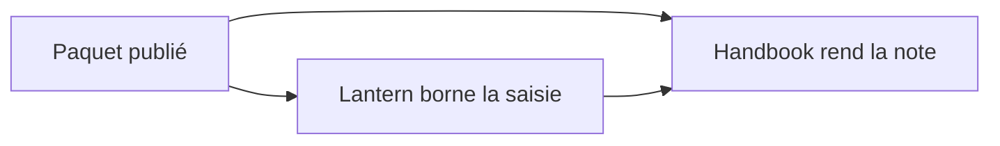
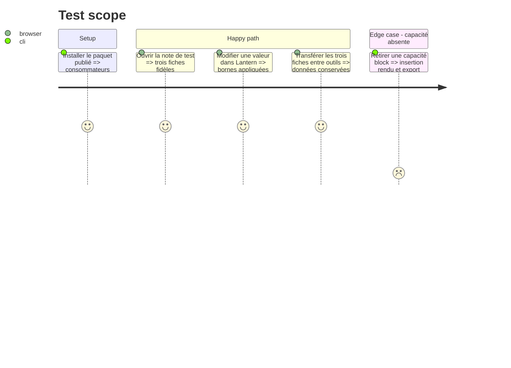

# Instruction: Adoption publiée dans Handbook et Lantern

## Architecture projection

> Tree of the final files. ✅ create · ✏️ modify · ❌ delete

```txt
../handbook/package.json                                      ✏️ dépendance sur le paquet publié
../handbook/src/features/adrenaline{Pj,Pnj,Monstre}/**        ✏️ finaliser les adaptateurs de rendu de la phase 2
../handbook/src/styles/adrenaline/_*.scss                     ✏️ finaliser l'application des tokens publiés
../handbook/src/features/blocks/**                             ✏️ menus, insertion et export conditionnés par les capacités publiées
../handbook/tools/assertAdrenalineContract.harness.mts       ✏️ source versionnée dérivée du catalogue et du manifeste
../lantern/package.json                                       ✏️ dépendance sur le paquet publié
../lantern/src/templates/adrenaline/shared/editor/{FieldPrimitives,AdrenalineFields}.tsx ✏️ bornes d'édition pilotées par le JSON Schema
../lantern/src/templates/adrenaline/{pj,pnj,monstre}/editor/*EditorPanel.tsx ✏️ appliquer les bornes aux trois formulaires
../lantern/src/templates/adrenaline/{pj,pnj,monstre}/preview/*Preview.tsx ✏️ rendu des valeurs actuelles selon le contrat
../lantern/src/templates/adrenaline/shared/preview/adrenalineTheme.css ✏️ tokens et polices publiés
```

## User Journey



## Test Scope



## Tasks to do

### `1)` Livrer Handbook depuis le paquet publié

> La prévisualisation locale devient une adoption testée, sans sémantique de jeu dupliquée.

1. Installer la baseline publiée et retirer le branchement provisoire.
2. Activer menus, rendu, insertion contextuelle et export TOML par les capacités `block:*` du manifeste.
3. Dériver les assertions de version du catalogue publié et du manifeste, sans version producteur codée en dur.
4. Vérifier les corpus et la note réelle sans remplacer ses blocs TOML par du HTML.

### `2)` Livrer Lantern depuis le même contrat

> L'éditeur applique les bornes publiées, le rendu n'affiche que les valeurs actuelles.

1. Alimenter les primitives de formulaire et les trois panneaux de saisie par `minimum` et `maximum` du JSON Schema publié.
2. Alimenter aussi les trois prévisualisations Lantern à partir des styles et règles de visibilité publiés.
3. Tester la saisie PJ, PNJ et monstre, puis un aller-retour Lantern → Handbook.

## Test acceptance criteria

| Task | Acceptance criteria |
| --- | --- |
| 1 | Handbook rend les trois blocs depuis le paquet publié ; une capacité absente coupe menu, rendu, insertion et export ; aucune version producteur n'est codée en dur dans les assertions. |
| 2 | Lantern borne les valeurs et rend les prévisualisations depuis le paquet ; l'aller-retour des trois fiches conserve les données, sans min/max dans les rendus. |
