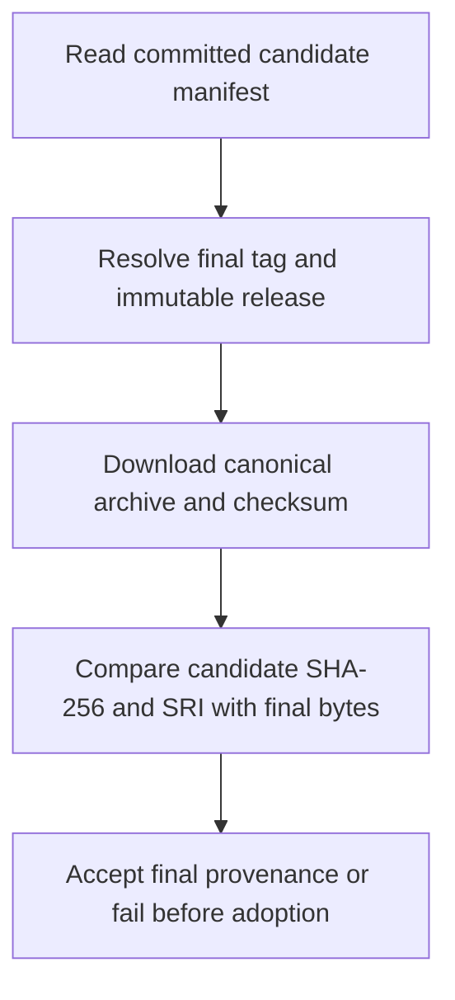
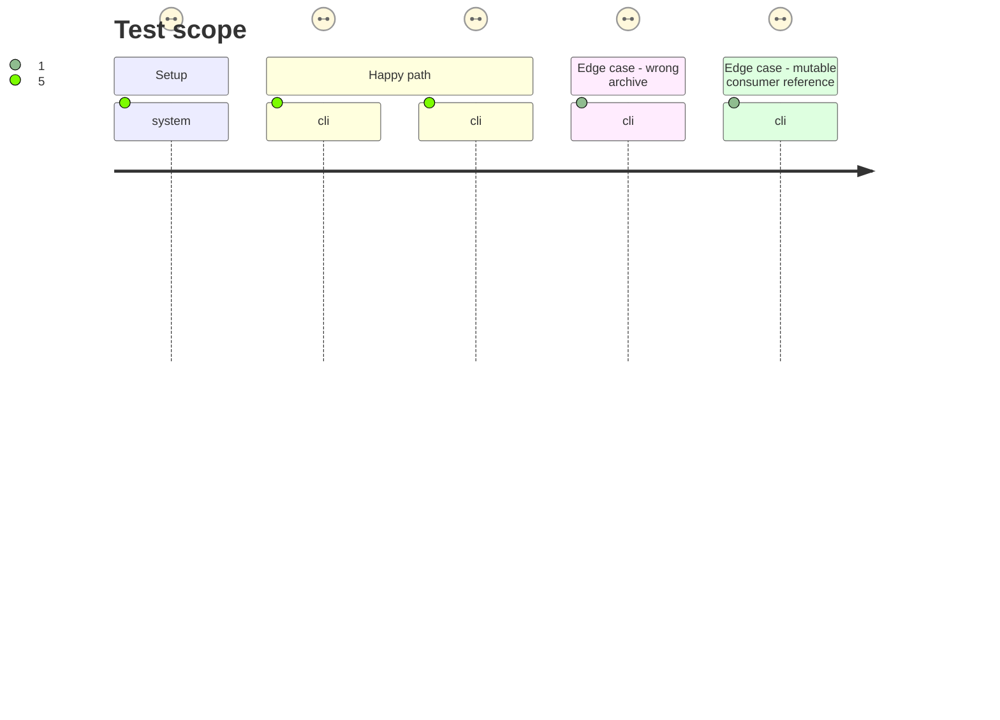

# Instruction: Define and verify the final archive contract

## Architecture projection

> Tree of the final files. ✅ create · ✏️ modify · ❌ delete

```txt
.
├── package.json                         ✏️ run final-provenance self-test in ordinary check
├── release-train/
│   └── README.md                       ✏️ define final record and consumer proof interface before adoption
├── tools/
│   ├── assert-final-release.ts          ✅ verify tag, immutable release, archive, checksum, SHA-256 and SRI
│   └── verify-final-convergence.ts      ✅ parse and self-test final record and consumer proof shape
```

## User Journey



## Test Scope



## Tasks to do

### `1)` Assert final release identity

> Prove the final URL names the canonical asset attached to the expected immutable provider tag.

1. Read version, final tag, candidate digest and SRI from the committed manifest; derive the final URL from those values.
2. Resolve the exact final tag commit and release metadata, require immutable public stable state and the canonical archive/checksum pair, and require the candidate manifest at that tag to match the committed manifest under review.
3. Download the final archive and checksum, verify checksum syntax and filename, SHA-256, SRI, and byte identity with the candidate archive.
4. Cover wrong tag, wrong asset name, missing checksum, digest mismatch and SRI mismatch with deterministic fixtures.

### `2)` Publish the final evidence interface

> Give the consumers a fixed final-artifact input before changing their assertions.

1. Reuse the existing protocol-2 final input shape (`protocol`, `artifact`, `consumers`), with a canonical Adrenaline URL, candidate SHA-256 and SRI, and full Lantern and Handbook commit SHAs.
2. Define verified evidence that also names the exact final tag commit and digest of the committed protocol-1 candidate manifest; require consumer proofs to name final URL, SRI, resolved package version, exact checked-out commit and successful journey.
3. Implement strict parsing and fixture self-tests for unknown fields, mutable references, mismatched candidate-manifest identity and absent consumer; add them to the ordinary check.

### `3)` Keep the ordinary provider gate complete

> Make the existing self-tests and new final contract visible in `npm run check`.

1. Confirm `validate:candidate-workflow`, `release-train:self-test`, canonical promotion naming and packed-package `validate:bundle` are already present and passing.
2. Add final release and convergence parser self-tests to `check` without duplicating existing release workflow assertions.
3. Document the post-promotion sequence and the immutable v2.5.0 exception already constrained in `validate-versioning.ts`.

## Test acceptance criteria

| Task | Acceptance criteria |
| ---- | ------------------- |
| 1 | v2.6.0 final URL, immutable release metadata, tag commit, checksum, SHA-256 and SRI can be checked as one chain; final and candidate bytes match. |
| 1 | A wrong asset, checksum, digest, SRI or tag fails without accepting a consumer pin. |
| 2 | The existing protocol-2 envelope is documented for Adrenaline before consumer implementation; mutable refs, missing consumers and wrong candidate-manifest identity fail fixture tests. |
| 3 | `npm run check` runs existing candidate publication and release-train self-tests, new final-provenance self-tests, and the installed-package esbuild execution proof. |
| 3 | Existing v2.5.0 exception remains restricted to that immutable release; later stable releases require canonical names. |
