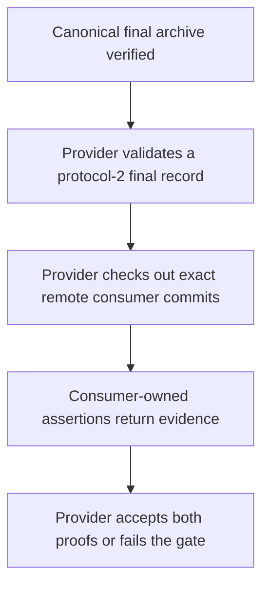
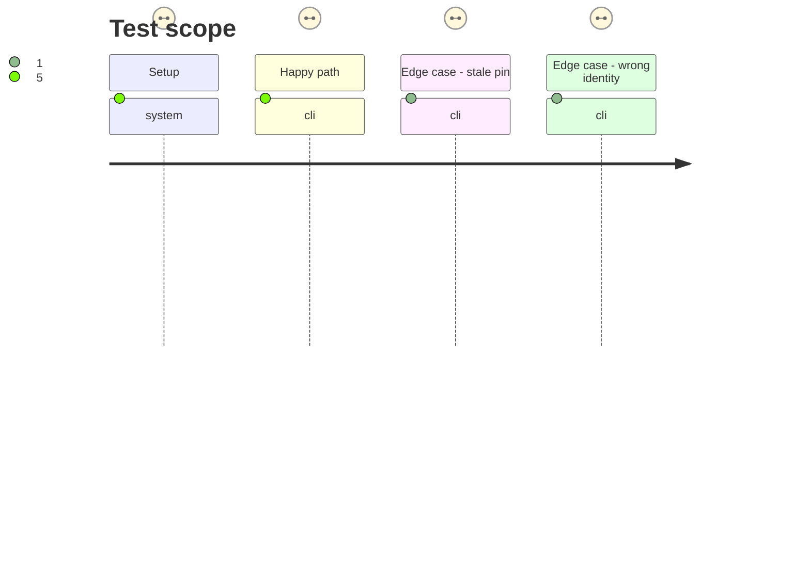

# Instruction: Build the provider-owned final convergence gate

## Architecture projection

> Tree of the final files. ✅ create · ✏️ modify · ❌ delete

```txt
.
├── package.json                         ✏️ include final convergence validation in the ordinary provider check
├── .github/workflows/
│   └── final-convergence.yml            ✅ checkout exact remote consumer commits and run their owned proofs
├── release-train/
│   └── README.md                         ✏️ document the provider handoff and external consumer prerequisites
└── tools/
    └── verify-final-convergence.ts      ✏️ verify exact consumer evidence and final record rules
```

## User Journey



## Test Scope



## Tasks to do

### `1)` Complete provider-side evidence validation

> Prove the published final archive and both consumer-owned results without editing either consumer repository.

1. Extend `verify-final-convergence.ts` to validate the protocol-2 final record, exact consumer roles/repositories/commits, lockfile URLs and SRI, and required journey status.
2. Require the final artifact to equal the candidate SHA-256 and SRI from the committed protocol-1 manifest; retain the exact provider tag commit and candidate-manifest digest in the output evidence.
3. Add deterministic positive and negative self-tests for stale RC URL, wrong SRI, wrong consumer commit, missing consumer and unknown fields.

### `2)` Provide an executable provider gate

> Make post-promotion verification runnable when consumer owners publish their commits.

1. Add a manually dispatched workflow that keeps the verifier checkout at the commit containing the final record and tools, then checks out the provider tag and each consumer at the full SHA from that record.
2. Invoke each consumer's own `release-train:assert` entry point and validate the two emitted protocol-2 evidence files; upload one provenance artifact.
3. Include the gate's self-tests in `npm run check`; when a committed final record exists, check its provider identity and exact remote consumer lockfile pins as part of the ordinary provider check.
4. Document that consumer migrations, final-proof code and immutable commits are tracked in issue #36 and must be delivered before phase 3.

## Test acceptance criteria

| Task | Acceptance criteria |
| ---- | ------------------- |
| 1 | Fixture proofs for both roles, exact commits, canonical URL and published SRI pass; stale RC URL, wrong SRI, mutable ref, wrong commit and absent consumer fail. |
| 1 | Provider evidence names the exact final tag commit and committed candidate-manifest digest without changing the historical candidate manifest. |
| 2 | The provider workflow accepts only committed final-record inputs and exact remote checkouts, delegates runtime assertions to consumers, and uploads combined evidence. |
| 2 | The ordinary provider check exercises candidate publication, promotion, final provenance and convergence rules while retaining the packed-package esbuild proof. |
