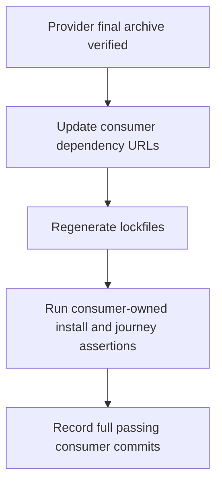
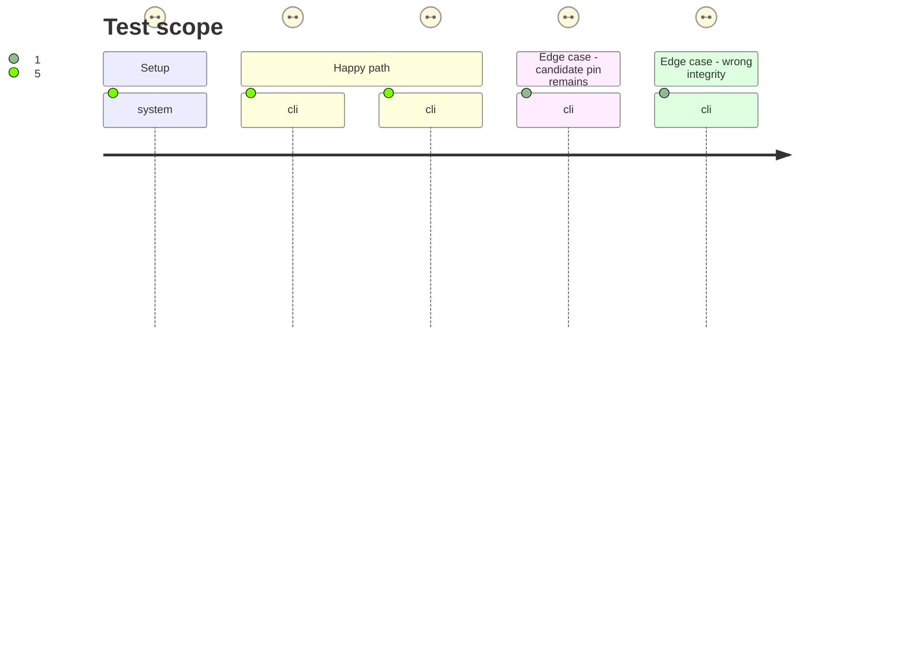

# Instruction: Adopt the final URL in both consumers

## Architecture projection

> Tree of the final files. ✅ create · ✏️ modify · ❌ delete

```txt
RebelliousSmile/lantern
└── tools/
    ├── release-train-protocol.mjs        ✏️ allow Adrenaline final artifact and canonical URL in existing final-proof parser
    └── release-train-assert.mjs          ✏️ prove final Adrenaline installation and Vite journey at immutable commit

RebelliousSmile/obsidian-handbook
├── package.json                         ✏️ move dependency from v2.6.0-rc.1 to v2.6.0 final URL
├── pnpm-lock.yaml                       ✏️ resolve the same final URL with unchanged published SRI
└── tools/
    ├── release-train-protocol.mjs        ✏️ accept the published Adrenaline final record
    └── release-train-schema-adrenaline-assert.mjs ✏️ prove final package installation and Handbook rendering/TOML journey
```

## User Journey



## Test Scope



## Tasks to do

### `1)` Confirm Lantern final adoption

> Preserve its existing v2.6.0 final URL and make the final proof explicit.

1. Verify Lantern's existing `package.json`, npm lockfile and pnpm lockfile resolve the canonical v2.6.0 URL and published SRI; change a pin only if that check finds drift.
2. Generalize its existing Mist-only protocol-2 parser and evidence assertion to Adrenaline without changing Mist behavior; exercise frozen install, contract checks and Vite build using a final-artifact fixture.
3. Record the full immutable Lantern commit SHA after those checks pass; phase 3 will run the combined final record against that commit.

### `2)` Move Handbook to the final archive

> Replace the RC URL while keeping the same proven package bytes and consumer behavior.

1. Change Handbook's dependency and lockfile to the v2.6.0 final URL; keep the manifest's SRI.
2. Extend its owned protocol-2 assertion and parser to accept Adrenaline without changing Mist behavior, and check the installed package, rendering, contextual insertion and TOML export through published `block:*` capability, with pack version derived from the catalogue and referenced manifest.
3. Run its frozen install and existing Handbook checks using a final-artifact fixture; record the full immutable Handbook commit SHA for phase 3.

## Test acceptance criteria

| Task | Acceptance criteria |
| ---- | ------------------- |
| 1 | Lantern's existing declaration and both lockfiles resolve the final canonical URL with the manifest SRI, and its consumer-owned final install and Vite proof pass at a full commit. |
| 2 | Handbook's declaration and lockfile resolve the same final URL and SRI, and its consumer-owned render, contextual insertion and TOML export proof passes at a full commit. |
| 2 | Handbook derives pack version from published metadata and uses the declared `block:*` capability to activate pack blocks. |
