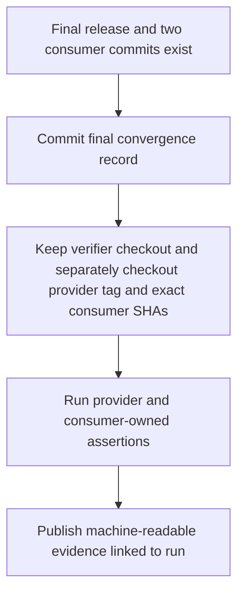
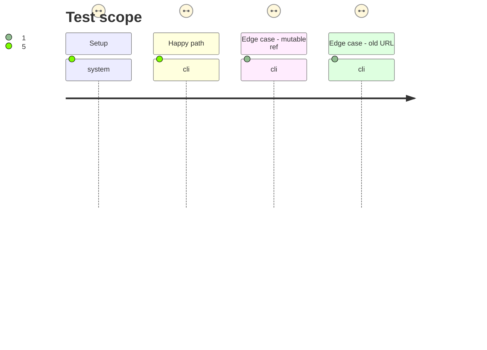

# Instruction: Enforce and record post-promotion convergence

## Architecture projection

> Tree of the final files. ✅ create · ✏️ modify · ❌ delete

```txt
.
├── package.json                         ✏️ validate committed final record in ordinary provider check
├── .github/workflows/
│   └── final-convergence.yml            ✅ explicit post-promotion gate for immutable consumer commits
├── release-train/
│   ├── README.md                         ✏️ describe required final handoff and evidence
│   └── schema-adrenaline-v2.6.0-final.json ✅ record final tag, archive and consumer commits
└── tools/
    └── verify-final-convergence.ts      ✏️ validate final consumer evidence against the record
```

## User Journey



## Test Scope



## Tasks to do

### `1)` Fix the post-promotion handoff

> Make final consumer adoption a required, independently runnable release-train step.

1. Fill the protocol-2 final record with the canonical URL, candidate SHA-256 and SRI, and both full consumer commits; derive the final tag and committed candidate manifest from its version.
2. Check each recorded commit equals the exact checkout and reject any stale consumer pin or mismatched consumer proof.
3. Keep the historical protocol-1 candidate manifest and its prerelease consumer refs unchanged.

### `2)` Verify and publish convergence evidence

> Tie the provider release and both final consumer journeys to one reproducible run.

1. Add a manually dispatched workflow that keeps its initial checkout at the commit carrying the final record and verification tools, separately checks out the exact provider tag and consumer commits, invokes the final archive verifier and consumer-owned proofs, then validates their machine-readable evidence.
2. Emit an artifact containing the final tag commit, committed candidate-manifest digest, release URL, SHA-256, SRI, both consumer SHAs, their lockfile URLs and proof status.
3. Once the final record is committed, make `npm run check` verify its final archive identity and both exact consumer lockfile pins at recorded SHAs; keep negative self-tests for mutable refs, mismatched SRI, wrong release URL and one missing consumer.
4. Link the successful run and evidence from issue #36, noting that v2.5.0's canonical URL remains impossible under its immutable tag.

## Test acceptance criteria

| Task | Acceptance criteria |
| ---- | ------------------- |
| 1 | The final record names both full consumer commits; validation resolves and records the exact provider tag commit and committed candidate-manifest digest without changing the historical manifest. |
| 2 | A successful gate proves byte-identical final archive and both consumer-owned final journeys, and publishes machine-readable evidence. |
| 2 | `npm run check` validates the committed final record against the final release and exact consumer lockfiles; a mutable ref, RC URL, missing consumer, wrong digest or SRI fails. |
