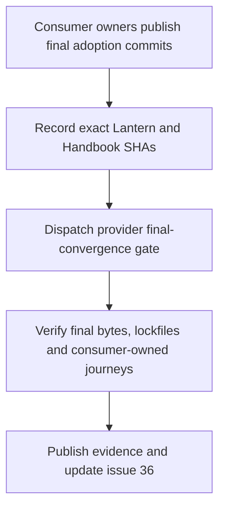
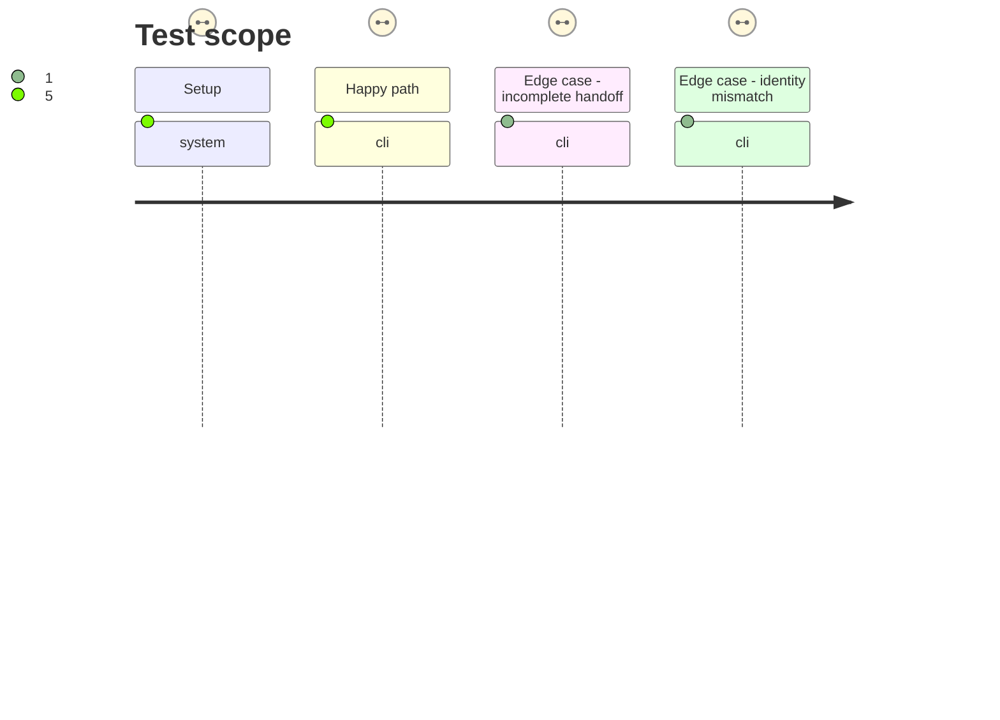

# Instruction: Record consumer commits and prove convergence

## Verified delivery

- Final record: `release-train/schema-adrenaline-v2.6.0-final.json`, committed in `cc6fac7a05801d3db7750dc5c445b8f2bfcccb9b` and merged by PR #37.
- Provider check: `npm.cmd run check` passed locally; [main CI](https://github.com/RebelliousSmile/schema-adrenaline/actions/runs/36425153763) passed at `f0a4df0ef7995ac416eef00eb33e299644478c9c`.
- [Final convergence workflow](https://github.com/RebelliousSmile/schema-adrenaline/actions/runs/36425159968) passed at the same provider commit with Lantern `66edca2f23c200e96ee56853216ef45a7021fb9a` and Handbook `f9f824838faa46c72966772d0c1df116411f0a80`.
- [Evidence artifact](https://github.com/RebelliousSmile/schema-adrenaline/actions/runs/36425159968/artifacts/10971685921): `sha256:70ce31fb11ab8ca1fa9f7c8f30285b22995d1d4654206b351b4315c75c579371`; its combined JSON and proof links are retained in [issue #36](https://github.com/RebelliousSmile/schema-adrenaline/issues/36#issuecomment-5870412774).

## Architecture projection

> Tree of the final files. ✅ create · ✏️ modify · ❌ delete

```txt
.
└── release-train/
    └── schema-adrenaline-v2.6.0-final.json ✅ pin the final artifact and two remote consumer commits
```

## User Journey



## Test Scope



## Tasks to do

### `1)` Pin the delivered consumer identities

> Seal the final record only after external owners finish their issue #36 tasks.

1. Read the full Lantern and Handbook commits supplied in issue #36; verify each is reachable remotely and included in that consumer's `main` history.
2. Verify both published consumer lockfiles resolve the canonical v2.6.0 URL with the candidate's SRI, then commit the protocol-2 final record with those exact SHAs.
3. Keep the protocol-1 candidate manifest and its historical prerelease consumer refs unchanged.

### `2)` Produce the final provenance chain

> Run the provider gate against the committed record and attach its evidence to the issue.

1. Dispatch the provider workflow at the commit carrying the final record and verification tools; require both consumer-owned protocol-2 assertions to pass at the recorded commits.
2. Retain the workflow artifact naming the final provider tag and tag commit, committed candidate-manifest digest, canonical archive URL, SHA-256, SRI, two consumer commits, lockfile URLs and journey statuses.
3. Run the ordinary provider check with the committed record, then link the successful gate and evidence in issue #36; keep the immutable v2.5.0 naming exception explicit.

## Test acceptance criteria

| Task | Acceptance criteria |
| ---- | ------------------- |
| 1 | The final record names the canonical v2.6.0 artifact and two full consumer commits that are reachable on their respective `main` histories. |
| 1 | Both exact consumer lockfiles contain the final URL and published SRI; the historical candidate manifest is unchanged. |
| 2 | The provider gate proves byte-identical final archive and both consumer-owned final journeys, and emits one machine-readable chain with the exact provider tag commit and both consumer SHAs. |
| 2 | A missing final consumer proof, RC URL, wrong digest, SRI or commit fails; issue #36 receives links to the passing run and evidence only after success. |
